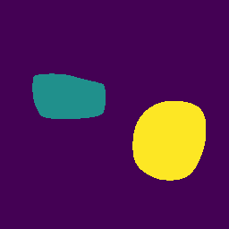
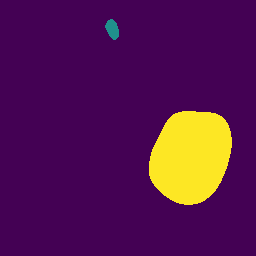
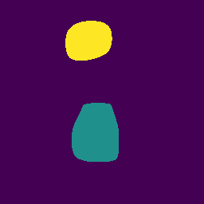
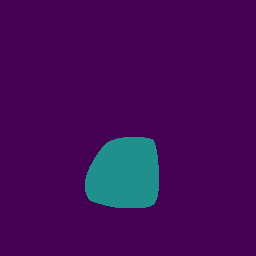
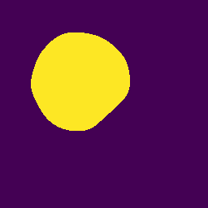
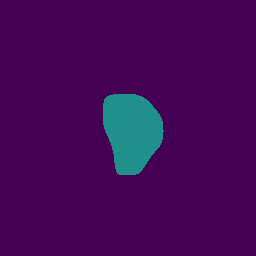
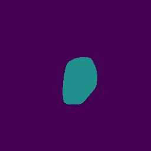

# EIT Image Reconstruction Algorithm
This is a submission for the [Kuopio Tomography Challenge](https://www.fips.fi/KTC2023.php). 

## Authors
- Amal Mohammed A Alghamdi (DTU), Denmark
- Martin Sæbye Carøe (DTU), Denmark
- Jasper Marijn Everink (DTU), Denmark
- Jakob Sauer Jørgensen (DTU), Denmark
- Kim Knudsen (DTU), Denmark
- Jakob Tore Kammeyer Nielsen (DTU), Denmark
- Aksel Kaastrup Rasmussen (DTU), Denmark
- Rasmus Kleist Hørlyck Sørensen (DTU), Denmark
- Chao Zhang (DTU), Denmark

## Addresses
DTU: Technical University of Denmark, Department of Applied Mathematics and Computer Science Richard Petersens Plads Building 324 2800 Kgs. Lyngby Denmark

## Description of the algorithm

We have used the provided code for the EIT image reconstruction with the following modifications:
- The Otsu segmentation algorithm has been replaced by the Chan-Vese segmentation algorithm from scikit-image.
- Additional generalized Tikhonov regularization has been added to penalize more when close to the missing electrodes (and boundary). The regularization matrix is a diagonal matrix. For example, for difficulty level 5, the diagonal elements mapped to image space look as in the image below:


## Installation instructions
To run our EIT image reconstruction algorithm, you will need:

- Python 3.x
- Required Python libraries (listed in `requirements.txt`)
- Access to the provided dataset (not included in this repository)

## Usage instructions

```
python main.py path/to/input/files path/to/output/files difficulty
```

## Examples
|  Phantom 	|  Ref	| Level 1 	| Level 4 	| Level 7 	|
|----------	|-----	|---	|---	|---	|
|**a**| 	| 	|   	|   	|   
|**b**| 	| 	|   	|   	|
|**c**| 	| 	|   	|   	|
|**d**| 	| 	|   	|   	|  

Scores for each phantom and difficulty 1,4 and 7:
**TODO: ADD SCORES FOR EACH ALGORITHM**
|   Phantom	| Level 1 	| Level 4 	| Level 7 	|
|-----	|---	|---	|---	|
|**a**||||
|**b**||||
|**c**||||
|**d**|||||
Scores have been computed using our own implementation of the scoring function based on scikit learn.

## License
All files in the repository come with the [Apache-v2.0](https://www.apache.org/licenses/LICENSE-2.0) license unless differently specified.